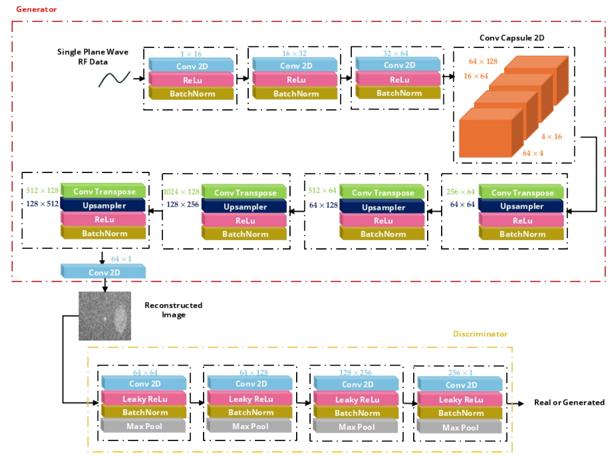
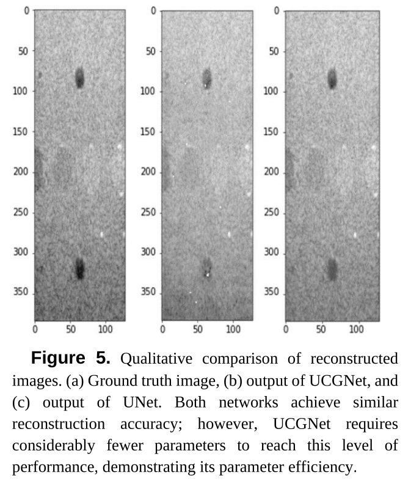
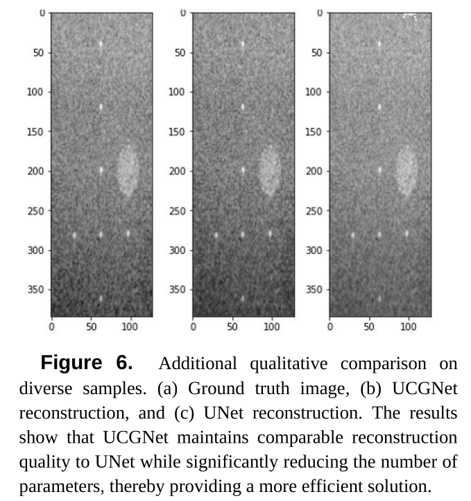

# UCGNet: Capsule-Guided GAN for Ultrasound Image Reconstruction

This repository provides the implementation of UCGNet (U-Caps-GAN Network), a novel deep learning architecture for ultrasound image reconstruction from single-plane wave RF data.

## Overview

Ultrasound image reconstruction traditionally relies on convolutional neural networks (CNNs) with a large number of parameters, which limits their deployment in real-time and embedded medical imaging systems.
This work introduces Capsule Neural Networks integrated into a GAN framework to achieve:

High-quality B-mode image reconstruction

Significantly reduced model size

Preservation of clinically important structural details

Suitability for real-time, resource-constrained environments

## Key Contributions

UCGNet: A hybrid architecture combining Capsule Networks and Generative Adversarial Networks

Direct reconstruction of B-mode ultrasound images from single-plane wave RF data

Parameter-efficient design leveraging vectorized feature representations and dynamic routing

Improved image fidelity compared to CNN-based baselines (e.g., UNet)

## Model Architecture

UCGNet integrates Capsule Networks into a GAN-based reconstruction pipeline:

Generator: Capsule-based network encoding spatial hierarchies and part–whole relationships

Discriminator: Ensures perceptual realism of reconstructed images

Capsule layers: Replace deep convolutional stacks to reduce redundancy while preserving structure

This design allows UCGNet to maintain diagnostic image quality with substantially fewer parameters.



## Dataset

PICMUS (Plane-wave Imaging Challenge in Medical Ultrasound) dataset

Input: Single-plane wave RF data

Output: Reconstructed B-mode ultrasound images

The dataset is not included in this repository. Please obtain it from the official PICMUS challenge website and follow the preprocessing steps described in the notebook.

## Repository Contents

```bash
├── UCGNet_training_validation.ipynb   # Training & validation notebook
├── README.md                          # Project documentation
```

The notebook includes:

Data loading and preprocessing

Model definition

Training loop

Validation and quantitative evaluation

## Sample Results




## Applications

Portable ultrasound systems

Embedded and real-time medical imaging

Low-power diagnostic devices

Research on efficient deep learning for medical ultrasound

## License

This project is intended for research and academic use.
Please cite the corresponding paper if you use this code in your work.

## Citation

If you use UCGNet in your research, please cite:

@article{UCGNet2026,
  title={UCGNet: Capsule-Guided GAN for Ultrasound Image Reconstruction from Single-Plane Wave RF Data},
}

## Acknowledgments

PICMUS Challenge organizers for providing the dataset

Prior work on Capsule Networks and GAN-based medical image reconstruction
